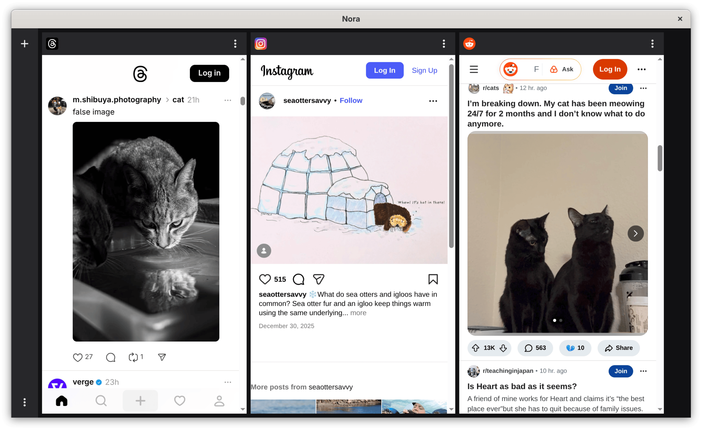

# Nora-Desktop

Facebook, Instagram, Reddit, Threads and X in a single app. No ads.

This repo only contains the desktop releases. Source code and mobile version can be found at https://github.com/nonbili/Nora. Please report feature requests and bugs there.

## Screenshots

